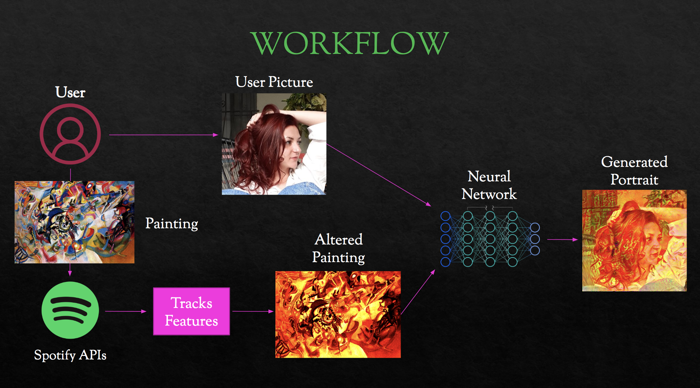

# CPAC22-Project

Creative Programming and Computing

A. Y. 2022-2023

# MUSICAL PORTRAIT

## Members of the group 
1.	Giorgio Bonizzi (https://github.com/Embodynglmp)
2.	Viola Negroni (https://github.com/violangg)
3.	Enrico Roncuzzi (https://github.com/enricoroncuzzi)
4.	Enrico Francesco Valente (https://github.com/enricovalente23)

## Github repository
[github.com/violangg/CPAC22-Project](https://github.com/violangg/CPAC22-Project)

# Abstract
Here we present a method for creating a portrait of a person based on their listening habits. The main goal is to create a unique and personalized depiction of the person that reflects their musical preferences. Our method is a novel approach to creating portraits and has potential applications in the fields of art, music, and personalization.

## Artistic vision
Do you really know yourself? Everyone knows your face, but how much does it really tell about your inner-self? If there is an activity in which you can be totally sincere with yourself is listening to music: a private space in which you can confront your feelings.

The goal of the project is therefore to give the user the possibility to look at him/herself from a new perspective, in which the traits of his/her face change depending on his/her musical taste.

## Prototype after the hackathon
The core of the project, which we aim to implement within the duration of the hackaton as a prototype, is to analyze the user's listening habits exploiting Spotify APIs and find his/her place in the "spectrum" of an Emotional Model, which is build starting from the features extracted from music.
In order to build a personalized virtual palette, each emotion on the spectrum will be associated to specific visual features, such as specific colors (or even shapes and painting styles).

A neural network (perhaps a CNN such as the VGG16) will then be exploited: taking as inputs the results coming from this last process and an image of the user's face, a portrait will be "painted" using a style which is strictly linked to the user's musical personality.

# Final project improvements
The ultimate goal is to increase the complexity of the emotional model, adding layers of variability and exploiting new features extracted from the music library. As a direct consequence, the next improvement will be the implementation of more artistic features, allowing to generate a richer and more personalized output.

It could be interesting as well to realize a 3D mesh of the user's face instead of just realizing a bidimensional painting, or even to include the possibility to modify, along with the style of the portrait, also the facial expression of the user (e.g make him/her smile if the main detected emotion is happiness).
Also, a desirable side upgrade could be to make the interaction between the user and the application easier, without having to request every time a token to use Spotify APIs.

# Workflow

